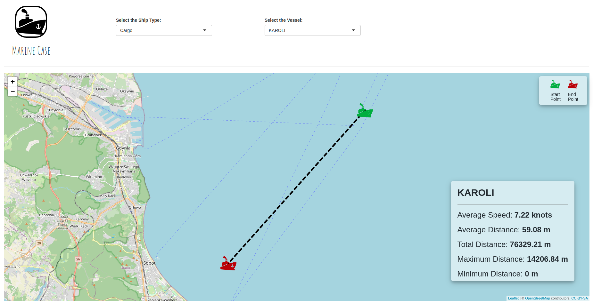

<!-- README.md is generated from README.Rmd. Please edit that file -->

```{r, include = FALSE}
knitr::opts_chunk$set(
  collapse = TRUE,
  comment = "#>"
)
```

# Marine Case

<!-- badges: start -->
<!-- badges: end -->

This is a shiny app created with the [Marine Data](https://drive.google.com/file/d/1IeaDpJNqfgUZzGdQmR6cz2H3EQ3_QfCV/view). The tool is online on shiny apps at the address https://adsoncostanzi.shinyapps.io/Marine/.




